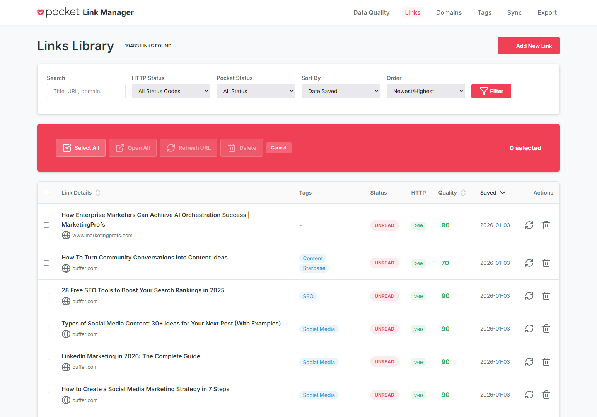
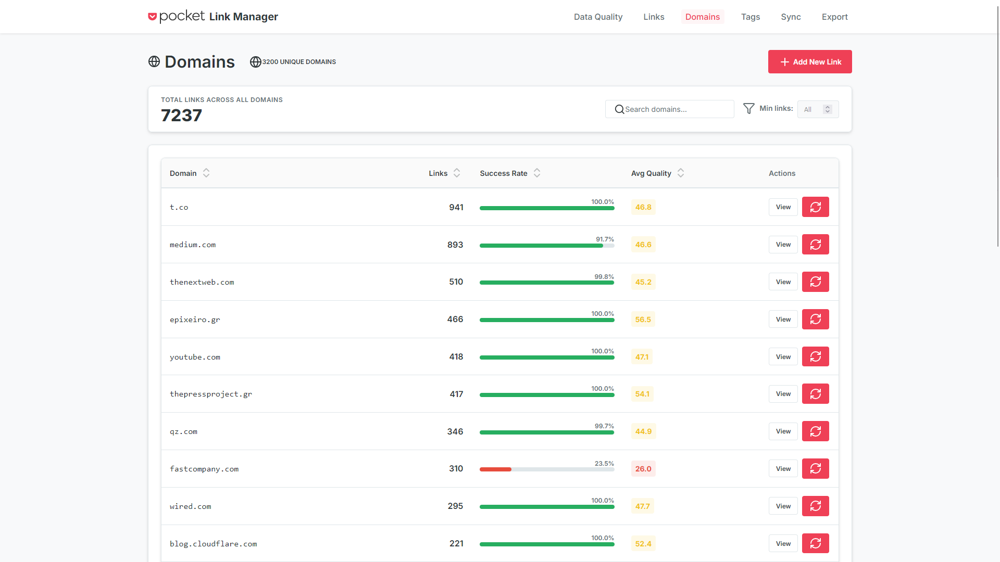
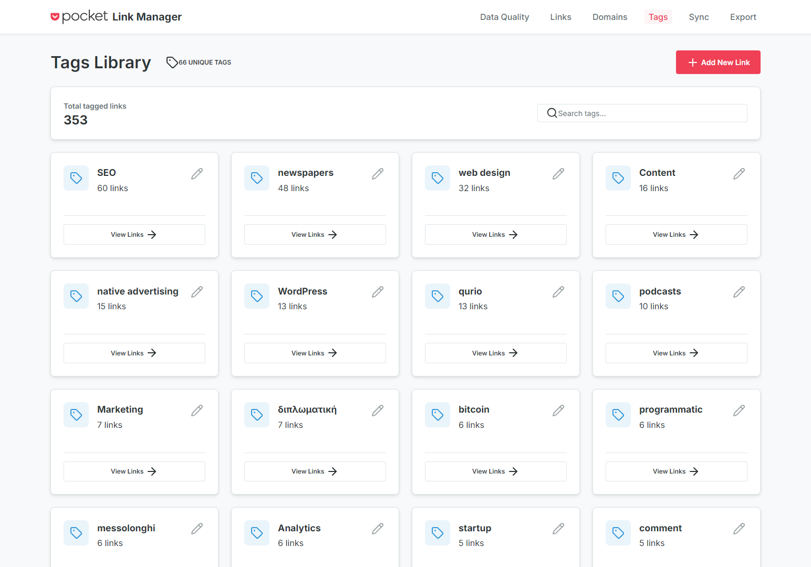
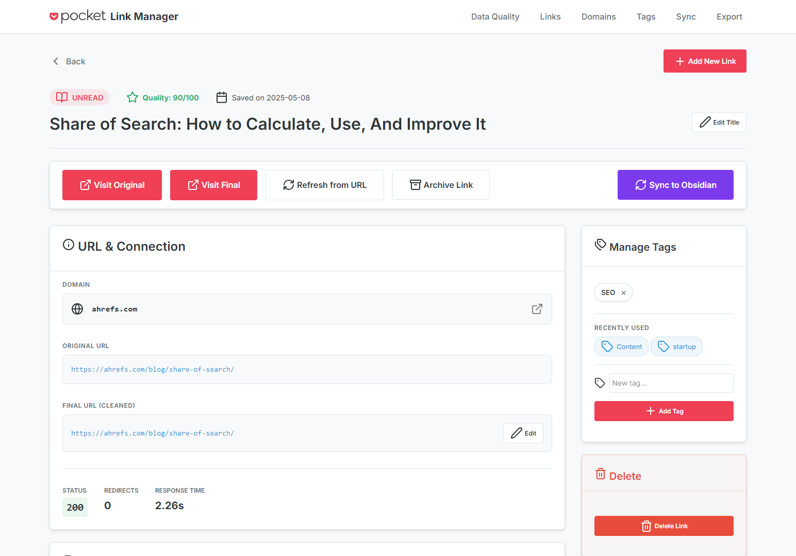
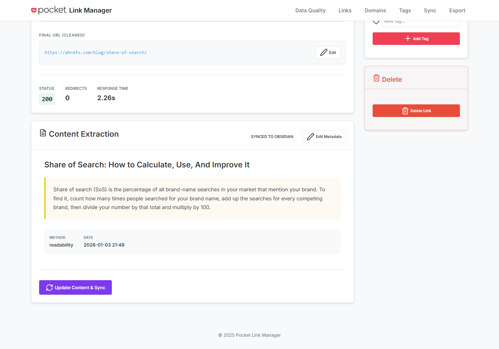
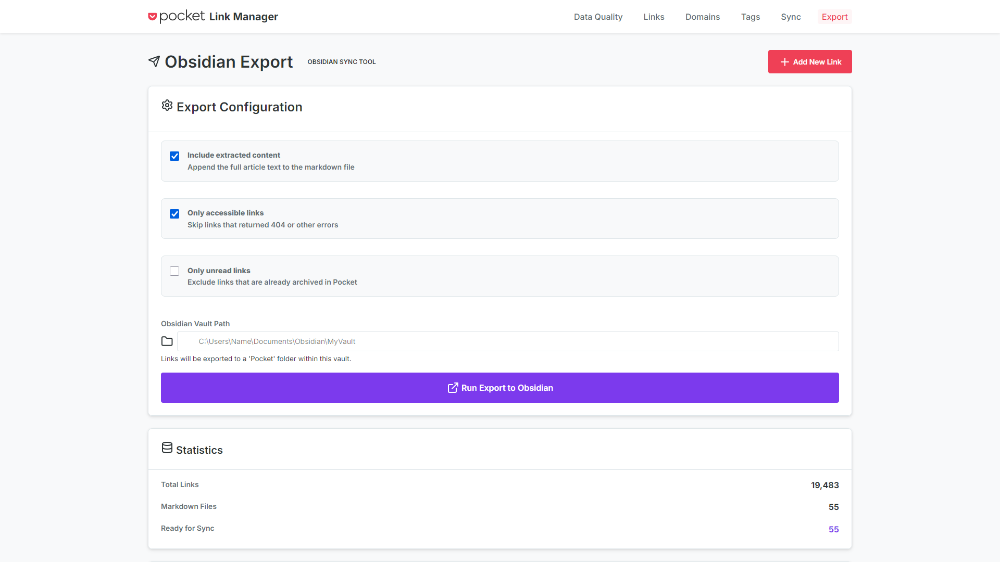

# Pocket Link Manager

**Save your reading list before it's gone.** With Pocket shutting down, this tool helps you preserve, organize, and take control of your saved articles collection.

## 🚨 Pocket Has Shut Down - We're Here to Help

**Important Update**: As of 2025, [Pocket has been shut down](https://getpocket.com/home) by Mozilla. Your carefully curated reading list needs a new home.

### Your Reading List Deserves Better

Years of saved articles, carefully tagged content, and reading discoveries shouldn't disappear just because one service shut down. Pocket Link Manager gives you:

✅ **Complete Control** - Your data stays on your computer, not someone else's cloud  
✅ **Never Lose Links Again** - Even if a service shuts down, your collection is safe  
✅ **Better Organization** - Search, filter, and organize in ways Pocket never could  
✅ **Export Anywhere** - Move your data to Obsidian, Notion, or wherever you want  

### What You Can Do

**Browse & Search**  
Open a beautiful web interface and explore your entire collection. Search by title, filter by domain, browse by tags - find any article in seconds.

**Verify Links**  
Automatically check which saved links still work. The tool visits each URL, follows redirects, and tells you which articles are still accessible.

**Export & Migrate**  
Export your collection to Markdown for Obsidian, CSV for spreadsheets, or JSON for other tools. Your data works wherever you need it.

**Preserve Content**  
Convert articles to markdown files with full content, not just links. Create your own personal archive that can't disappear.

---

## Getting Started

### What You'll Need

- A Pocket export file (CSV format)
- Python 3.12 or newer installed
- 2 minutes to set up

### Step 1: Get Your Pocket Data

**If Pocket export is still available:**
1. Log in to [getpocket.com](https://getpocket.com)
2. Go to Settings → Export
3. Download your data as CSV

**Already have an export?** Perfect! Jump to Step 2.

### Step 2: Start Pocket Link Manager

**That's it!** Just double-click **`Start Here.bat`** and everything happens automatically:

- ✅ Checks if Python is installed
- ✅ Installs dependencies automatically
- ✅ Initializes the database
- ✅ Starts the web server
- ✅ Opens your browser automatically

The browser will open to `http://127.0.0.1:5000` and you'll see the setup wizard.

### Step 3: Import Your Data

1. **Upload your CSV file** - Drag and drop or click to browse
2. **Watch the import progress** - See real-time updates as your data is imported
3. **Done!** - You'll be automatically redirected to your dashboard



The import process handles everything automatically. For 10,000 articles, this takes about 2-3 minutes.

### That's It!

You're now ready to explore your collection! The web interface lets you:
- Browse and search all your saved articles
- Filter by domain, tags, or status
- Export to various formats
- And much more!

---

## What You Can Do

### 📖 Browse Your Reading List

**Dashboard**: See your collection at a glance - total articles, unread count, quality metrics, top domains.



**Link Browser**: Scroll through all your saved articles with thumbnails and metadata. Sort by date, domain, or quality score.



**Search**: Find any article instantly by searching titles and URLs. The search is fast, even with 20,000+ articles.

**Filter**: Show only unread articles, filter by specific websites, or browse by tags. Combine filters to find exactly what you need.

### 🏷️ Organize with Tags

**Tag Browser**: See all your tags and how many articles each one has. Click any tag to see those articles.



**Add & Remove Tags**: Manage tags individually or in bulk. Rename tags across your entire collection.

**Tag Statistics**: Discover your most-used tags and find under-utilized ones.

### 🔍 Verify Your Links

**Automatic Crawling**: The crawler visits each URL and checks if it's still accessible.

**Redirect Tracking**: See where links redirect to - helpful for shortened URLs or moved content.

**Status Reporting**: Know which articles are still live (200 OK), which are gone (404), and which have issues.

**Quality Metrics**: Get insights into link health and accessibility across your collection.

### 📤 Export & Share

**Export to CSV**: Download your filtered results as a spreadsheet. Great for sharing lists or further analysis.

**Markdown Export**: Create markdown files perfect for Obsidian, Logseq, or any markdown-based note system.



**JSON Export**: Export structured data for use in other applications or custom scripts.

**Bulk Convert**: Turn entire collections into markdown files with one command.

### 🎯 Smart Features

**Domain Grouping**: See all articles from a specific website. Perfect for exploring all your Medium articles or NYTimes saves.

**Quality Scoring**: Automatically rates link quality based on accessibility, working status, and metadata.

**Duplicate Detection**: Find and manage duplicate URLs in your collection.

**UTM Cleaning**: Strips tracking parameters from URLs for cleaner links.

---

## Common Tasks

### Find All Articles from a Specific Site

1. Open the Links page
2. Click the domain filter
3. Select the website you want
4. See all articles from that domain

### Export Your Unread List

1. Go to Links page
2. Filter by "Unread" status
3. Click "Export"
4. Choose CSV or Markdown
5. Download your file

### Create Markdown Files for Obsidian

1. Filter to the articles you want
2. Click "Convert to Markdown" 
3. Files are saved in the `data/markdown/` folder
4. Copy them to your Obsidian vault

### Check Which Links Still Work

1. Run the crawler: `python scripts/crawler/url_crawler.py`
2. Wait for it to check all URLs (be patient, it's respectful to servers)
3. View results in the dashboard
4. Filter by status code to find broken links

---

## Understanding Your Dashboard


**Total Links**: How many articles you've saved over the years

**Unread Count**: Articles you saved but haven't read yet

**Domains**: How many different websites you've saved from

**Average Quality**: Overall health score of your collection (100 = perfect)

**Status Breakdown**: 
- 🟢 Green (200s): Links work perfectly
- 🟡 Yellow (300s): Redirects (usually fine)
- 🔴 Red (400s/500s): Broken or inaccessible

**Top Domains**: Your most-saved websites - discover your reading patterns

For detailed link information, click on any article to see the full detail page:



---

## Need Help?

### The Interface Won't Load

1. Make sure you double-clicked `Start Here.bat` and the server started successfully
2. Check that port 5000 isn't being used by another app
3. Try accessing `http://127.0.0.1:5000` directly in your browser
4. Check the console window for any error messages

### Import Failed

1. Verify your CSV is from Pocket (check the columns)
2. Make sure the file is a valid CSV format
3. Check the error message in the setup wizard for specific issues
4. Try uploading the file again

### Links Not Working

1. Some websites block automated tools - this is normal
2. The crawler is respectful and slow - it takes time
3. You can adjust crawler settings in the script

### Advanced Usage

If you prefer command-line setup or want to customize:

```bash
# Install dependencies
pip install -e .

# Initialize database
python -c "from database.init_db import init_database; init_database()"

# Start server
python run.py
```

Check out the [Technical Documentation](docs/README.md) for:
- Database structure and queries
- Web interface customization
- API endpoints
- Advanced scripting

---

## Why Self-Host Your Reading List?

**You Own Your Data**: No company can shut down your tool or delete your collection.

**Privacy**: Your reading list stays on your computer. No tracking, no data mining.

**No Subscription**: Free forever. No monthly fees or feature limits.

**Customizable**: It's open source - modify it however you want.

**Works Offline**: Access your collection even without internet.

---

## What's Inside

- **Web Interface** - Beautiful, responsive browser interface
- **Database** - Fast SQLite database that handles 100,000+ articles
- **Crawler** - Respectful URL checker that verifies your links
- **Extractor** - Converts web pages to clean, readable markdown
- **Exporter** - Multiple export formats for any use case

For technical details about each component, see the [Developer Documentation](docs/README.md).

---

## Project Info

**Status**: Active development, stable for daily use  
**Version**: 0.1.0 Beta  
**License**: [To be added]  
**Maintenance**: Actively maintained

Built with ❤️ for people who value their reading lists.

---

## Next Steps

1. **[Export your Pocket data](#step-1-get-your-pocket-data)** if you haven't already
2. **[Double-click Start Here.bat](#step-2-start-pocket-link-manager)** - it's that simple!
3. **[Upload your CSV](#step-3-import-your-data)** through the web interface
4. **[Explore your collection](#thats-it)** and organize your links
5. **[Share your experience](https://github.com/stellarpartners/pocket-link-manager/issues)** - help us improve!

**Questions?** Check the [Documentation](docs/README.md) or [open an issue](https://github.com/stellarpartners/pocket-link-manager/issues).
