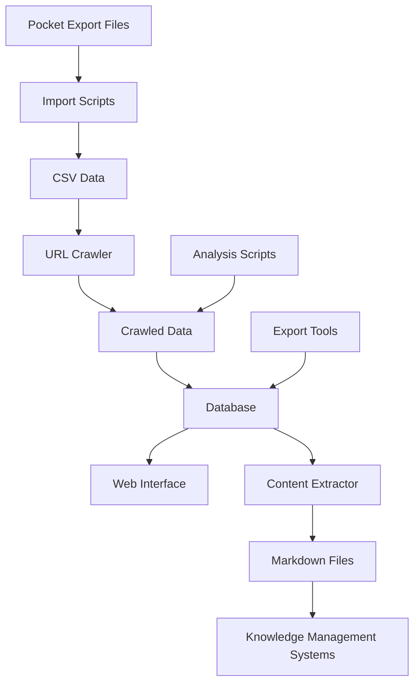

# Pocket Link Manager

A comprehensive toolkit for extracting, crawling, processing, and managing your Pocket saved articles. Export to Obsidian, Notion, or any knowledge management system.

## Overview

Pocket Link Manager helps you organize, analyze, and export your Pocket bookmarks. It provides:

- **Data Import** - Import and merge Pocket export files
- **URL Crawling** - Visit links, follow redirects, track status codes
- **Content Extraction** - Convert web pages to clean markdown
- **Database Management** - Store and query your link collection
- **Web Interface** - Browse, search, and filter your links
- **Export Tools** - Export to various formats (Markdown, CSV, JSON) for Obsidian, Notion, or any knowledge management system

## Architecture



## Features

- **Multi-format Import** - CSV and JSON Pocket exports
- **Intelligent Crawling** - Respectful, resumable URL crawling with redirect tracking
- **Content Extraction** - Convert web pages to clean markdown using multiple extraction methods
- **Database Storage** - SQLite database with comprehensive querying
- **Web Interface** - Flask-based UI for browsing and managing links
- **Quality Metrics** - Automatic quality scoring and accessibility tracking
- **Tag Management** - Process and clean Pocket tags
- **Export Capabilities** - Export filtered results to CSV, Markdown, or JSON for integration with Obsidian, Notion, or any knowledge management system

## Installation

### Requirements

- Python 3.12+ (Python 3.13+ recommended for best performance)
- pip

### Setup

1. Clone the repository:

```bash
git clone <repository-url>
cd pocket-link-manager
```

2. Install dependencies:

```bash
pip install -r requirements.txt
pip install -r scripts/utils/requirements_crawler.txt
```

3. Initialize the database:

```bash
python -c "from database.init_db import init_database; init_database()"
```

## Quick Start

### 1. Import Your Pocket Data

Place your Pocket export files in `data/pocket_export/`:

```
data/pocket_export/
├── part_000000.csv
├── part_000001.csv
├── annotations/
│   └── part_000000.json
```

Run the merge script:

```bash
python scripts/import/pocket_merge_script.py
```

This creates `data/pocket_merged.csv` with all your Pocket data.

### 2. Crawl URLs (Optional)

Visit all URLs and track redirects:

```bash
python scripts/crawler/url_crawler.py
```

Or test with a small sample first:

```bash
python scripts/crawler/test_crawler.py
```

### 3. Import to Database

Import the crawled data into the database:

```bash
python tools/import_full_dataset.py
```

### 4. Start Web Interface

Browse and manage your links:

```bash
python run.py
```

Visit http://127.0.0.1:5000

### 5. Analyze Results

Analyze crawl results:

```bash
python scripts/analysis/analyze_crawl_results.py
```

## Project Structure

```
pocket-link-manager/
├── database/           # Database models, queries, importer
├── extractor/         # URL extraction and markdown conversion
├── web/               # Flask web application
├── scripts/           # Utility scripts
│   ├── crawler/      # URL crawling tools
│   ├── analysis/     # Data analysis scripts
│   ├── import/       # Import and processing tools
│   └── utils/        # Utility scripts
├── tools/             # Root-level utility tools
├── tests/             # Test scripts
├── docs/              # Documentation
├── data/              # Data files (ignored by git)
├── logs/              # Log files (ignored by git)
├── run.py             # Main entry point
├── requirements.txt   # Python dependencies
└── pyproject.toml     # Project metadata and Python version requirements
```

## Directory Documentation

Each major directory has its own README:

- [`database/README.md`](database/README.md) - Database models and queries
- [`extractor/README.md`](extractor/README.md) - Content extraction
- [`web/README.md`](web/README.md) - Web interface
- [`scripts/README.md`](scripts/README.md) - Utility scripts overview
- [`tools/README.md`](tools/README.md) - Root-level tools
- [`tests/README.md`](tests/README.md) - Testing documentation
- [`docs/PYTHON_VERSION.md`](docs/PYTHON_VERSION.md) - Python version compatibility guide

## Usage Examples

### Extract Content from URL

```python
from extractor.url_to_markdown import URLToMarkdownConverter

converter = URLToMarkdownConverter()
result = converter.convert("https://example.com/article")

if result['success']:
    print(result['markdown'])
```

### Query Database

```python
from database.queries import LinkQuery, StatisticsQuery

link_query = LinkQuery()
links = link_query.search("python", limit=10)

stats_query = StatisticsQuery()
total = stats_query.get_total_count()
```

### Clean UTM Parameters

```bash
# Preview changes
python scripts/import/clean_utm_parameters.py

# Apply changes
python scripts/import/clean_utm_parameters.py --execute
```

## Configuration

### Database

Database is stored in `data/pocket_links.db` by default. Set `DATABASE_PATH` environment variable to customize.

### Crawler Settings

Edit crawler configuration in `scripts/crawler/url_crawler.py`:

```python
config = {
    'csv_path': 'data/pocket_merged.csv',
    'max_workers': 5,           # Parallel requests
    'delay_range': (1, 3),      # Delay between requests (seconds)
    'batch_size': 100           # Save progress every N URLs
}
```

### Web Application

Set environment variables:

- `SECRET_KEY` - Flask secret key
- `DATABASE_PATH` - Custom database path

## Testing

Run test suite:

```bash
python tests/test_database.py
```

Verify database:

```bash
python tests/verify_database.py
```

## Data Files

The following directories are ignored by git (see `.gitignore`):

- `data/` - All data files (CSV, JSON, database)
- `logs/` - Crawler logs and progress files
- `__pycache__/` - Python cache

## Contributing

This is a personal toolkit, but contributions are welcome. Please ensure:

- Code follows existing style
- Tests pass
- Documentation is updated

## License

[Add your license here]

## Acknowledgments

Built with:

- Flask - Web framework
- SQLAlchemy - Database ORM
- Trafilatura - Content extraction
- Pandas - Data processing
- Requests - HTTP library
